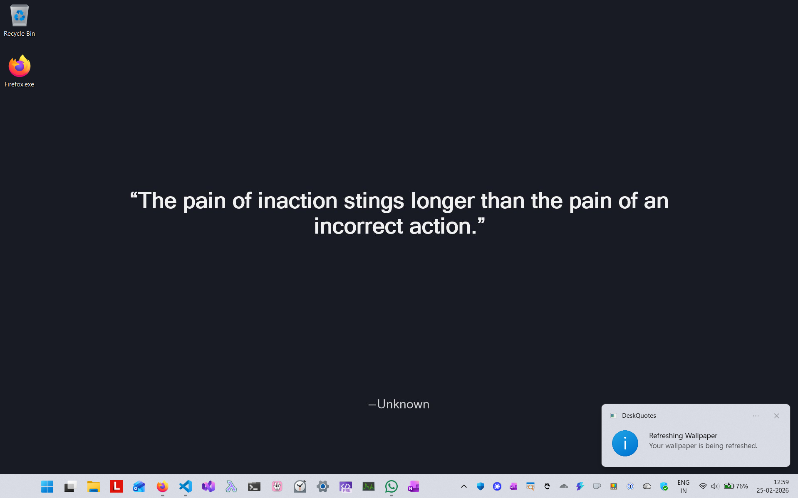

# DeskQuotes

[](https://github.com/mithunshanbhag/desk-quotes/actions/workflows/deploy.yml)




DeskQuotes is a Windows tray app that rotates your desktop wallpaper using quotes from a local `settings.json` file, logs diagnostics through `ILogger<T>`, and can forward logs/traces to Azure Application Insights through the same settings file.

## Installation

1. Install the .NET 10 SDK on Windows.
2. Clone this repository.
3. Restore dependencies:

```powershell
dotnet restore .\DeskQuotes.slnx
```

## Usage

1. Run the app (see the next section).
2. Use the tray icon menu to:
    - **Refresh Wallpaper (Ctrl + Alt + U)**
    - **Set Mood**
      - **All Quotes**
      - **Any configured mood from `tagCatalog`**
    - **Wallpaper Background Color**
      - **Darken Color (Ctrl + Alt + -)**
      - **Lighten Color (Ctrl + Alt + =)**
      - **Random Color (Ctrl + Alt + 0)**
    - **Change Wallpaper Font**
      - **Random Font (Ctrl + Alt + F)**
    - **Edit Settings (Ctrl + Alt + E)** (opens `settings.json`)
    - **Exit**
3. Press `Ctrl + Alt + U` from anywhere, or use the tray menu, to trigger an immediate wallpaper refresh.
4. Standard wallpaper refreshes rotate the quote font among `Segoe UI`, `Georgia`, `Palatino Linotype`, `Trebuchet MS`, and `Constantia`.
5. Use the background color submenu or its hotkeys to immediately darken, lighten, or randomize the wallpaper background color while keeping the current quote font unchanged.
6. Use `Ctrl + Alt + F`, or the tray menu, to switch to a different curated font while keeping the current quote and background.
7. Successful wallpaper, background-color, font, and settings actions triggered from either the tray menu or the global hotkeys show a compact on-screen HUD overlay near the bottom-center of the primary display so the action is visible immediately without opening a full notification.
8. Use **Set Mood** to persist a mood selection across restarts. With **All Quotes** selected, every configured quote remains eligible. When a mood is selected, only quotes whose `tags` contain that mood are eligible for refreshes, background-color changes, and random-font updates. If no configured quote matches the selected mood, DeskQuotes keeps the current wallpaper and shows a warning instead of falling back to all quotes.
9. Edit quotes and optional diagnostics settings in `src\DeskQuotes\settings.json`, then refresh from the tray menu.

## Configuration

`src\DeskQuotes\settings.json` now contains both the quote catalog and optional diagnostics settings. To forward application logs and traces to Azure Application Insights, set `applicationInsights.connectionString`:

```json
{
  "applicationInsights": {
    "connectionString": "InstrumentationKey=...;IngestionEndpoint=https://..."
  },
  "logging": {
    "logLevel": {
      "default": "Information",
      "DeskQuotes": "Information",
      "Microsoft": "Warning"
    }
  }
}
```

Leave the connection string blank to keep telemetry disabled. When the connection string is present, DeskQuotes sends its `ILogger<T>`-based application logs and traces to the configured Application Insights instance.

## Build and run locally

Quick run during development:

```powershell
dotnet run --project .\src\DeskQuotes\DeskQuotes.csproj
```

Convenience script:

```powershell
.\run-local.ps1 -target app
```

## Build the MSI installer

Build the installer on Windows with the .NET CLI:

```powershell
dotnet build .\src\DeskQuotes.MSI\DeskQuotes.MSI.wixproj -c Release --nologo
```

The generated MSI will be written to:

```text
src\DeskQuotes.MSI\bin\Release\DeskQuotes.msi
```

Install it from File Explorer or with:

```powershell
msiexec /i .\src\DeskQuotes.MSI\bin\Release\DeskQuotes.msi
```

The installer performs a per-user install under `%LocalAppData%\DeskQuotes` so the bundled `settings.json` remains editable without requiring administrator rights.

## Run tests

```powershell
.\run-local.ps1 -target unit-tests
```

Additional local targets:

```powershell
.\run-local.ps1 -target tests
.\run-local.ps1 -target e2e-tests
```
